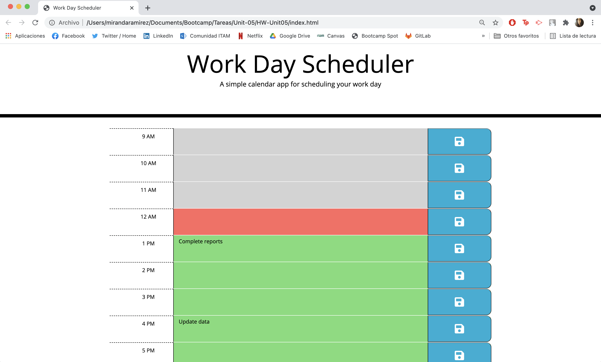

# 05 Third-Party APIs: Work Day Scheduler
# Miranda Ramírez Caballero

## The Task

Create a simple calendar application that allows a user to save events for each hour of the day by modifying starter code. This app will run in the browser and feature dynamically updated HTML and CSS powered by jQuery.

## The Solution
* In order to update each block according to the current time, the library [Moment.js](https://momentjs.com/) was utilized in a loop that is executed each time the page loads
* The user is able to enter the text they desire
* When they click the save button, the text elements are saved in an array which is then rendered into local storage
* Local storage is revisited each time the user loads the page, allowing it to save the previously entered text

## The Deployed Application

### Screenshot of the deployed application: 

### Link to the deployed application:
* [Link to deployed application](https://mirandarmz.github.io/HW-Unit05/)

You'll need to use the [Moment.js](https://momentjs.com/) library to work with date and time. Be sure to read the documentation carefully and concentrate on using Moment.js in the browser.

## Conclusion

Overall, I found the assignment to be challenging and a good task to apply my new knowledge. I believe to have excelled the requirements and expectations of the assignment. 

- - -
© 2021 Trilogy Education Services, LLC, a 2U, Inc. brand. Confidential and Proprietary. All Rights Reserved.
